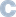

# Awesome Seismology

> A curated list of awesome tools and resources for seismologists.
>
> Is your favourite tool or resource missing? Feel free to open an issue or a pull request!

- [Awesome Seismology](#awesome-seismology)
  - [Array seismology](#array-seismology)
  - [Earthquake analysis](#earthquake-analysis)
  - [Earthquake bulletins/catalogues](#earthquake-bulletinscatalogues)
  - [Educational resources](#educational-resources)
  - [Distributed acoustic sensing](#distributed-acoustic-sensing)
  - [Geodetics](#geodetics)
  - [Imaging](#imaging)
  - [Inversion \& Inference](#inversion--inference)
  - [Machine learning](#machine-learning)
  - [Marine Seismology](#marine-seismology)
  - [Seismic data access](#seismic-data-access)
  - [Seismic data handling](#seismic-data-handling)
  - [Seismic interferometry \& ambient noise](#seismic-interferometry--ambient-noise)
  - [Source localisation](#source-localisation)
  - [Synthetic seismograms](#synthetic-seismograms)
  - [Synthetic travel times, ray parameters and ray paths](#synthetic-travel-times-ray-parameters-and-ray-paths)
  - [Visualisation](#visualisation)

## Array seismology

- [acoular](https://www.acoular.org) - Acoustic testing and source mapping software 
- [B3AM](https://github.com/katrinloer/B3AM) / [B3Ampy](https://github.com/cl-finger/B3Ampy) - Toolbox for easy and fast beamforming analysis of three-component array data  / 
- [beampower](https://github.com/ebeauce/beampower) - Beamforming (or backprojection) of seismic signal for event detection and location 
- [covseisnet](https://github.com/covseisnet/covseisnet) - Array covariance matrix analysis 
- [EQTransformer](https://github.com/smousavi05/EQTransformer) - AI-based earthquake signal detector and phase picker 
- [fast_beamforming](https://github.com/schipp/fast_beamforming) - Fast and efficient beamforming in Python 
- [Qseek (pyrocko)](https://github.com/pyrocko/qseek) - The friendly earthquake detector 

## Earthquake analysis

- [Grond (pyrocko)](https://pyrocko.org) - Probabilistic source optimization 
- [BEAT (pyrocko)](https://pyrocko.org) - Bayesian Earthquake Analysis Tool 
- [BPMF](https://github.com/ebeauce/Seismic_BPMF) - Earthquake detection and location with GPU-accelerated processing 
- [Earthworm](https://gitlab.com/seismic-software/earthworm/) - Waveform and automatic earthquake processing software 
- [focmec](https://seiscode.iris.washington.edu/projects/focmec) - Package for determining and displaying earthquake focal mechanisms
- [HypoDD](https://www.ldeo.columbia.edu/~felixw/hypoDD.html) - Double-difference earthquake location algorithm 
- [NonLinLoc](https://github.com/alomax/NonLinLoc) - Non-Linear locations 
- [PhaseNet](https://github.com/AI4EPS/PhaseNet) - Deep-neural-network-based seismic arrival time picking method 
- [PyOcto](https://github.com/yetinam/pyocto) - High-throughput seismic phase associator 
- [SEISAN](https://seisan.info) - Earthquake analysis software 
- [SeisComP](https://www.seiscomp.de) - Seismological software for data acquisition, processing, distribution and interactive analysis 
- [SeisSol](https://seissol.org) - Software package for simulating wave propagation and dynamic rupture 
- [Simul2023](https://zenodo.org/records/10695070) - inversion of earthquake data for 3-D velocity and hypocenters or 3-D Q 

## Earthquake bulletins/catalogues

- [BGR](https://www.szgrf.bgr.de) - Bulletin of the Federal Institute for Geosciences and Natural Resources, Germany
- [EMSC](https://emsc-csem.org) - Bulletin of the Euro-Mediterranean Seismological Centre
- [GEOFON](https://geofon.gfz-potsdam.de) - Bulletin of the GeoForschungsZentrum Potsdam, Germany
- [Global CMT](https://www.globalcmt.org) - Bulletin of the Global Centroid-Moment-Tensor (CMT) Project
- [ISC](https://www.isc.ac.uk/iscbulletin/) - Bulletin of the International Seismological Centre, UK
- [IGN](https://www.ign.es/web/en/ign/portal/sis-catalogo-terremotos) - Bulletin of the Instituto Geografico Nacional, Spain
- [SED](http://www.seismo.ethz.ch/en/home/) - Bulletin of the Swiss Seismological Service, Switzerland
- [USGS](https://earthquake.usgs.gov/earthquakes/map/) - Bulletin of the US Geological Survey, USA

## Educational resources

- [seismo-live](https://seismo-live.github.io) - Live jupyter notebooks for seismology 

## Distributed acoustic sensing

- [awesome-das](https://github.com/DAS-RCN/awesome-das) - Curated list of awesome resources for distributed acoustic sensing (DAS).
- [DASCore](https://dascore.netlify.app) - Python library for distributed fiber optic sensing 

## Geodetics

- [geokernels](https://github.com/sigmaterra/geokernels) - Fast geospatial distance and geodesic kernel computation 

## Imaging

- [BayesBay](https://github.com/fmagrini/bayes-bay) - Generalised trans-dimensional and hierarchical Bayesian inference 
- [MSNoise-Tomo](https://github.com/ThomasLecocq/msnoise-tomo) - Plugin to the MSNoise framework for 2D tomography 
- [PyGLImER](https://github.com/PyGLImER/PyGLImER) - Workflow to create a global database for Ps and Sp receiver function imaging 

## Inversion & Inference

- [BayesBay](https://github.com/fmagrini/bayes-bay) - Generalised trans-dimensional and hierarchical Bayesian inference 
- [DeepDenoiser](https://github.com/AI4EPS/DeepDenoiser) - Seismic signal denoising and decomposition using deep neural networks 
- [GeoBED](https://github.com/dominik-strutz/GeoBED) - Optimal experimental design tailored to geoscientific applications 
- [pyGIMLi](https://www.pygimli.org) - Multi-method modelling and inversion in geophysics 
- [Simul2023](https://zenodo.org/records/10695070) - flexible program for inversion of earthquake data for 3-D velocity and hypocenters or 3-D Q 

## Machine learning

- [EQTransformer](https://github.com/smousavi05/EQTransformer) - AI-based earthquake signal detector and phase picker 
- [SeisBench](https://github.com/seisbench/seisbench) - Python toolbox for machine learning in seismology 
- [PhaseNet](https://github.com/AI4EPS/PhaseNet) - Deep-neural-network-based seismic arrival time picking method 

## Marine Seismology

- [OCloC (OBS Clock Correction)](https://ocloc.readthedocs.io/en/latest/index.html) - Detect and correct timing errors when using passive seismic records 

## Seismic data access

- [EarthScope](https://ds.iris.edu/ds/nodes/dmc/data/) (formerly IRIS) - Waveform and event data access, US based.
- [EIDA (ORFEUS)](https://orfeus-eu.org/data/eida/) - Waveform and event data access, EU based.

## Seismic data handling

- [Earthworm](https://gitlab.com/seismic-software/earthworm/) - Waveform and automatic earthquake processing software 
- [ObsPy](https://github.com/obspy/obspy/wiki/) - Python framework for processing seismological data 
- [SeisComP](https://www.seiscomp.de) - Seismological software for data acquisition, processing, distribution and interactive analysis 
- [Seismic Handler](https://www.seismic-handler.org) - Powerful seismic waveform analysis tool
- [Seismic Unix](https://github.com/JohnWStockwellJr/SeisUnix) - Seismic processing, research, and educational software package
- [Seis.jl](https://github.com/anowacki/Seis.jl) - Open, fast and flexible framework for analysing seismic data in Julia 
- [Snuffler (pyrocko)](https://pyrocko.org) - Seismogram browser and workbench 

## Seismic interferometry & ambient noise

- [MSNoise](http://www.msnoise.org) - Python package for monitoring using ambient seismic noise 
- [NoisePy](https://github.com/noisepy/NoisePy) - Fast and easy computation of ambient noise cross-correlation functions 
- [noisi](https://github.com/lermert/noisi) - Ambient noise cross-correlation modeling and inversion 
- [SANS](https://sans.ethz.ch) - Seismic ambient noise source maps
- [SeisNoise.jl](https://github.com/JuliaSeismo/SeisNoise.jl) - Fast and easy ambient noise cross-correlation in Julia 
- [SeisMIC](https://github.com/PeterMakus/SeisMIC) - Seismological monitoring using interferometric concepts 
- [WMSAN](https://tomasetl.gricad-pages.univ-grenoble-alpes.fr/ww3-source-maps/) - Wave model sources of ambient noise 

## Source localisation

- [acoular](https://www.acoular.org) - Acoustic testing and source mapping software 
- [beampower](https://github.com/ebeauce/beampower) - Beamforming (or backprojection) of seismic signal for event detection and location 
- [BPMF](https://github.com/ebeauce/Seismic_BPMF) - Earthquake detection and location with GPU-accelerated processing 
- [fast_beamforming](https://github.com/schipp/fast_beamforming) - Fast and efficient beamforming in Python 
- [HypoDD](https://www.ldeo.columbia.edu/~felixw/hypoDD.html) - Double-difference earthquake location algorithm 
- [NonLinLoc](https://github.com/alomax/NonLinLoc) - Non-Linear locations 
- [Simul2023](https://zenodo.org/records/10695070) - inversion of earthquake data for 3-D velocity and hypocenters or 3-D Q 

## Synthetic seismograms

- [AxiSEM](https://github.com/geodynamics/axisem) - Axially symmetric Spectral Element Method 
- [Axitra](https://github.com/coutanto/axitra) - Seismograms in 3D plane layered medium  
- [Computer Programs in Seismology](https://github.com/rbherrmann/ComputerProgramsSeismology) - Package of programs for making synthetic seismograms
- [Fomosto (pyrocko)](https://pyrocko.org) - Calculate and manage Green’s function databases 
- [instaseis](https://instaseis.net) - Instant global seismograms based on a broadband waveform database 
- [noisi](https://github.com/lermert/noisi) - Ambient noise cross-correlation modeling and inversion 
- [Salvus](https://mondaic.com) - Proprietary waveform simulations and inversions
- [SeisSol](https://seissol.org) - Software package for simulating wave propagation and dynamic rupture 
- [SPECFEM](https://specfem.org) - Open-source spectral-element method software codes for computational seismology  
- [SW4](https://github.com/geodynamics/sw4) - Seismic waves, 4th order accuracy  

## Synthetic travel times, ray parameters and ray paths

- [TauP](http://www.seis.sc.edu/taup/) - Seismic travel time calculator 
- [Cake (pyrocko)](https://pyrocko.org) - 1D travel-time and ray-path computations 
- [scikit-fmm](https://github.com/scikit-fmm/scikit-fmm) - Fast Marching Method for Python 
- [pykonal](https://github.com/malcolmw/pykonal) - Fast Marching Method in cartesian or spherical coordinates in 2 or 3 dimensions 

## Visualisation

- [cartopy](https://scitools.org.uk/cartopy/docs/latest/) - Maps for matplotlib 
- [cmcrameri](https://www.fabiocrameri.ch/colourmaps/) - Scientific colour maps
- [cmocean](https://matplotlib.org/cmocean/) - Beautiful colormaps for oceanography
- [GMT](https://www.generic-mapping-tools.org) - Generic Mapping Tools
- [Paraview](https://www.paraview.org) - The world’s leading open source post-processing visualization engine
- [Scientific Visualization (open access book)](https://github.com/rougier/scientific-visualization-book)
