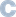

# Awesome Seismology 

Earthquakes, Earth's structure, and related methodology.

## Contents

- [Array seismology](#array-seismology)
- [Earthquake bulletins/catalogues](#earthquake-bulletinscatalogues)
- [Educational resources](#educational-resources)
- [Fibre optic sensing](#fibre-optic-sensing)
- [Imaging](#imaging)
- [Inversion \& Inference](#inversion--inference)
- [Machine learning](#machine-learning)
- [Marine seismology](#marine-seismology)
- [Observatory software](#observatory-software)
- [Phase picking and association](#phase-picking-and-association)
- [Raytracing](#raytracing)
- [Seismic data access](#seismic-data-access)
- [Seismic data handling](#seismic-data-handling)
- [Seismic hazard](#seismic-hazard)
- [Seismic interferometry and ambient noise](#seismic-interferometry-and-ambient-noise)
- [Source parameter estimation](#source-parameter-estimation)
- [Synthetic seismograms](#synthetic-seismograms)

## Array seismology

- [acoular](https://www.acoular.org) - Acoustic testing and source mapping software. 
- [B3AM](https://github.com/katrinloer/B3AM) & [B3Ampy](https://github.com/cl-finger/B3Ampy) - Toolbox for easy and fast beamforming analysis of three-component array data.  
- [beampower](https://github.com/ebeauce/beampower) - Beamforming (or backprojection) of seismic signal for event detection and location. 
- [covseisnet](https://github.com/leonard-seydoux/covseisnet) - Array covariance matrix analysis. 
- [fast_beamforming](https://github.com/schipp/fast_beamforming) - Fast and efficient beamforming in Python. 
- [TwistPy](https://twistpy.org) - Toolbox for wavefield inertial sensing techniques. 

## Earthquake bulletins/catalogues

- [BGR](https://www.szgrf.bgr.de) - Bulletin of the Federal Institute for Geosciences and Natural Resources, Germany.
- [EMSC](https://emsc-csem.org) - Bulletin of the Euro-Mediterranean Seismological Centre.
- [GEOFON](https://geofon.gfz-potsdam.de) - Bulletin of the GeoForschungsZentrum Potsdam, Germany.
- [Geosphere Austria](https://beta.geosphere.at/de/karten/aktuelle-erdbeben#tab=tablemode) - Bulletin of the Geosphere Austria.
- [Global CMT](https://www.globalcmt.org) - Bulletin of the Global Centroid-Moment-Tensor (CMT) Project.
- [IGN](https://www.ign.es/web/en/ign/portal/sis-catalogo-terremotos) - Bulletin of the Instituto Geografico Nacional, Spain.
- [INGV](https://www.ingv.it/en/resources-and-services/environment-earthquakes-and-volcanoes/newsletters) - Bulletin of the Instituto Nazionale Di Geofisicia e Vulcanologia, Italy.
- [ISC](https://www.isc.ac.uk/iscbulletin/) - Bulletin of the International Seismological Centre, UK.
- [ROB](http://seismology.be/en) - Bulletin of the Royal Observatory of Belgium.
- [SED](http://www.seismo.ethz.ch/en/home/) - Bulletin of the Swiss Seismological Service, Switzerland.
- [USGS](https://earthquake.usgs.gov/earthquakes/map/) - Bulletin of the US Geological Survey, USA.

## Educational resources

- [seismo-live](https://seismo-live.github.io) - Live jupyter notebooks for seismology. 

## Fibre optic sensing

- [awesome-das](https://github.com/DAS-RCN/awesome-das) - Curated list of awesome resources for Distributed Acoustic Sensing (DAS).
- [DASCore](https://dascore.netlify.app) - Python library for distributed fiber optic sensing. 
- [DASPack](https://github.com/asleix/daspack) - Controlled data compression for Distributed Acoustic Sensing.  
- [dastools](https://git.gfz-potsdam.de/javier/dastools) - Tools to work with data generated by DAS systems. 
- [Lightguide](https://github.com/pyrocko/lightguide) - Package for handling, filtering and modelling Distributed Acoustic Sensing (DAS) data.  
- [Xdas](https://github.com/xdas-dev/xdas) - Python library for managing, processing and visualizing Distributed Acoustic Sensing (DAS) data. 

## Imaging

- [FLEXWIN](https://geodynamics.org/resources/flexwin) & [Pyflex](https://github.com/adjtomo/pyflex) - Automates the time-window selection problem for seismologists.  
- [MSNoise-Tomo](https://github.com/ThomasLecocq/msnoise-tomo) - Plugin to the MSNoise framework for 2D tomography. 
- [Pyatoa](https://github.com/adjtomo/pyatoa) - Python's Adjoint Tomography Operations Assistant. 
- [PyGLImER](https://github.com/PyGLImER/PyGLImER) - Workflow to create a global database for Ps and Sp receiver function imaging. 
- [SeisFlows](https://github.com/adjtomo/seisflows) - Waveform inversion package that tackles the problems of seismic wavefield simulation, full waveform inversion, seismic migration, and adjoint tomography. 
- [SeisLib](https://github.com/fmagrini/seislib) - Python package that allows for obtaining seismic images of the sub-surface. 
- [swspy](https://github.com/TomSHudson/swspy/) - Python package for performing shear wave splitting in an automated manner. 

## Inversion & Inference

- [BayesBay](https://github.com/fmagrini/bayes-bay) - Generalised trans-dimensional and hierarchical Bayesian inference. 
- [GeoBED](https://github.com/dominik-strutz/GeoBED) - Optimal experimental design tailored to geoscientific applications. 
- [pyGIMLi](https://www.pygimli.org) - Multi-method modelling and inversion in geophysics. 

## Machine learning

- [DeepDenoiser](https://github.com/AI4EPS/DeepDenoiser) - Seismic signal denoising and decomposition using deep neural networks. 
- [EQS-Denoiser](https://github.com/niko-d/EarthquakeSeismogramDenoiser) - Earthquake seismogram denoiser. 
- [SeisBench](https://github.com/seisbench/seisbench) - Python toolbox for machine learning in seismology. 
- [scatseisnet](https://github.com/scatseisnet/scatseisnet) - Transform time series into scattering coefficients with a scattering network. 

## Marine seismology

- [obsinfo](https://gitlab.com/resif/smm/obsinfo) - A system for creating FDSN-standard data and metadata for
ocean bottom seismometers. 
- [OBSTools](https://github.com/nfsi-canada/OBStools) - Processing broadband ocean-bottom seismic data. 
- [OCloC (OBS Clock Correction)](https://ocloc.readthedocs.io/en/latest/index.html) - Detect and correct timing errors when using passive seismic records. 

## Observatory software

- [Antelope](https://brtt.com) - Real time Earth monitoring for a dynamic world.
- [Earthworm](https://gitlab.com/seismic-software/earthworm/) - Waveform and automatic earthquake processing software. 
- [SEISAN](https://seisan.info) - Earthquake analysis software. 
- [SeisComP](https://www.seiscomp.de) - Seismological software for data acquisition, processing, distribution and interactive analysis. 

## Phase picking and association

- [EQTransformer](https://github.com/smousavi05/EQTransformer) - AI-based earthquake signal detector and phase picker. 
- [GaMMA](https://github.com/AI4EPS/GaMMA) - Gaussian Mixture Model Associator. 
- [OBSTransformer](https://github.com/alirezaniki/OBSTransformer) - A Deep Learning Seismic Phase Picker for OBS Data. 
- [PhaseNet](https://github.com/AI4EPS/PhaseNet) - Deep-neural-network-based seismic arrival time picking method. 
- [PyOcto](https://github.com/yetinam/pyocto) - High-throughput seismic phase associator. 

## Raytracing

- [TauP](http://www.seis.sc.edu/taup/) - Seismic travel time calculator. 
- [Cake (pyrocko)](https://pyrocko.org/docs/current/apps/cake/) - 1D travel-time and ray-path computations. 
- [scikit-fmm](https://github.com/scikit-fmm/scikit-fmm) - Fast Marching Method for Python. 
- [pykonal](https://github.com/malcolmw/pykonal) - Fast Marching Method in cartesian or spherical coordinates in 2 or 3 dimensions. 

## Seismic data access

- [EarthScope](https://ds.iris.edu/ds/nodes/dmc/data/) (formerly IRIS) - Waveform and event data access, US based.
- [EIDA (ORFEUS)](https://orfeus-eu.org/data/eida/) - Waveform and event data access, EU based.
- [FDSN network codes](https://www.fdsn.org/networks/) - List of all seismic network codes assigned by the FDSN.
- [PyWEED](https://github.com/iris-edu/pyweed) - An application for retrieving event-based seismic data. 
- [STEAD](https://github.com/smousavi05/STEAD) - STanford EArthquake Dataset (STEAD):A Global Data Set of Seismic Signals for AI.

## Seismic data handling

- [ObsPy](https://github.com/obspy/obspy/wiki/) - Python framework for processing seismological data. 
- [Pyrocko](https://pyrocko.org) - Open source seismology toolbox and library. 
- [SeisGo](https://github.com/xtyangpsp/SeisGo) - Ready-to-go Python toolbox for seismic data analysis. 
- [SeisKit.jl](https://github.com/JuliaEarth/SeisKit.jl) - Fast IO operations with SEG-Y files and other basic utilities for working with seismic data. 
- [Seismic Unix](https://github.com/JohnWStockwellJr/SeisUnix) - Seismic processing, research, and educational software package.
- [Seis.jl](https://github.com/anowacki/Seis.jl) - Open, fast and flexible framework for analysing seismic data in Julia. 
- [Yasmine](https://github.com/iris-edu/yasmine-stationxml-editor) - Yet Another Station Metadata INformation Editor to create and edit geophysical station metadata information in FDSN stationXML format.

## Seismic hazard

- [nshmp-haz](https://code.usgs.gov/ghsc/nshmp/nshmp-haz) - U.S. Geological Survey (USGS) National Seismic Hazard Model Project (NSHMP) codes for performing probabilistic seismic hazard (PSHA) and related analyses. 
- [OpenQuake Engine](https://github.com/gem/oq-engine) - Open source software that provides calculation and assessment of seismic hazard, risk and decision-making tools. 
- [strata](https://github.com/arkottke/strata) & [pystrata](https://github.com/arkottke/pystrata) - Site response program featuring simulated profiles, random vibration theory, and a graphical user interface.  

## Seismic interferometry and ambient noise

- [MSNoise](http://www.msnoise.org) - Python package for monitoring using ambient seismic noise. 
- [NoisePy](https://github.com/noisepy/NoisePy) - Fast and easy computation of ambient noise cross-correlation functions. 
- [noisi](https://github.com/lermert/noisi) - Ambient noise cross-correlation modeling and inversion. 
- [SANS](https://sans.ethz.ch) - Seismic ambient noise source maps.
- [SeisNoise.jl](https://github.com/JuliaSeismo/SeisNoise.jl) - Fast and easy ambient noise cross-correlation. 
- [SeisMIC](https://github.com/PeterMakus/SeisMIC) - Seismological monitoring using interferometric concepts. 
- [WMSAN](https://github.com/lystom/WMSAN) - Wave model sources of ambient noise. 

## Source parameter estimation

- [Grond (pyrocko)](https://pyrocko.org/grond) - Probabilistic source optimization. 
- [BEAT (pyrocko)](https://pyrocko.org/beat) - Bayesian Earthquake Analysis Tool. 
- [BPMF](https://github.com/ebeauce/Seismic_BPMF) - Earthquake detection and location with GPU-accelerated processing. 
- [focmec](https://seiscode.iris.washington.edu/projects/focmec) - Package for determining and displaying earthquake focal mechanisms.
- [GrowClust3D](https://github.com/dttrugman/GrowClust3D.jl) - Relative relocation of earthquake hypocenters based on waveform cross-correlation data. 
- [HypoDD](https://www.ldeo.columbia.edu/~felixw/hypoDD.html) - Double-difference earthquake location algorithm 
- [NonLinLoc](https://github.com/alomax/NonLinLoc) - Non-Linear locations. 
- [QuakeMigrate](https://github.com/QuakeMigrate/QuakeMigrate) - Python package for automatic earthquake detection and location using waveform migration and stacking. 
- [Qseek (pyrocko)](https://github.com/pyrocko/qseek) - The friendly earthquake detector. 
- [Simul2023](https://zenodo.org/records/10695070) - Inversion of earthquake data for 3-D velocity and hypocenters or 3-D Q. 
- [SKHASH](https://code.usgs.gov/esc/SKHASH) - Earthquake focal mechanism inversions. 

## Synthetic seismograms

- [AxiSEM](https://github.com/geodynamics/axisem) - Axially symmetric Spectral Element Method (2.5D). 
- [AxiSEM3D](https://github.com/AxiSEMunity/AxiSEM3D) - Axially symmetric Spectral Element Method (3D). 
- [Axitra](https://github.com/coutanto/axitra) - Seismograms in 3D plane layered medium.  
- [Computer Programs in Seismology](https://github.com/rbherrmann/ComputerProgramsSeismology) - Package of programs for making synthetic seismograms.
- [disba](https://github.com/keurfonluu/disba) - Surface wave dispersion modeling. 
- [Fomosto (pyrocko)](https://pyrocko.org/docs/current/apps/fomosto/) - Calculate and manage Green's function databases. 
- [instaseis](https://instaseis.net) - Instant global seismograms based on a broadband waveform database. 
- [Mineos](https://github.com/geodynamics/mineos) - Compute synthetic seismograms in a spherically symmetric non-rotating Earth by summing normal modes. 
- [PyFK](https://github.com/ziyixi/pyfk) - Python port of FK used to calculate the Green's function and the synthetic waveforms for the 1D Earth model. 
- [SeisSol](https://seissol.org) - Software package for simulating wave propagation and dynamic rupture. 
- [SPECFEM](https://specfem.org) - Open-source spectral-element method software codes for computational seismology.  
- [SW4](https://github.com/geodynamics/sw4) - Seismic waves, 4th order accuracy.  
